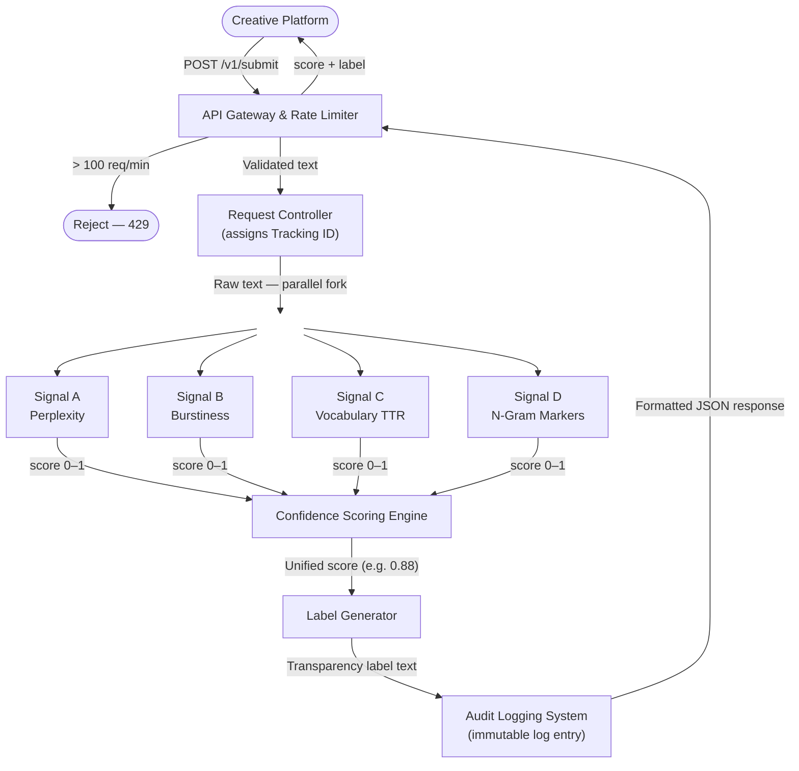
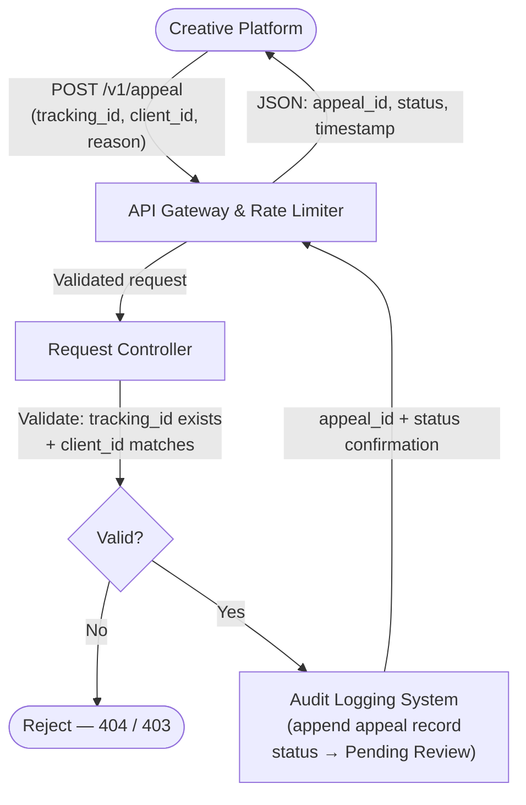

# Provenance Guard — Implementation Planning Document

---

## Architecture

### Submission Flow

A creative platform POSTs raw text to the API Gateway, which enforces a rate limit and hands a validated payload to the Request Controller — the component that assigns a unique tracking ID and fans the text out in parallel to four independent detection signals. Each signal produces a normalized 0.0–1.0 AI-likelihood score, which the Confidence Scoring Engine combines into a single weighted confidence score; the Label Generator translates that score into one of three transparency label variants. Before returning anything to the caller, the full record — original text, per-signal scores, final confidence score, and label — is written as an immutable entry to the Audit Log.



---

### Appeal Flow

When a submitter disputes a classification, the platform POSTs the original tracking ID, the client ID that made the submission, and a free-text reason to the appeals endpoint; the Request Controller validates that the tracking ID exists and that the client ID matches the original submission before proceeding. On success, the Audit Log entry for that tracking ID is updated in an append-only fashion — `appeal_status` is set to `"Pending Review"` and the appeal payload is appended as a sub-record, while the original detection scores and label remain untouched. The platform receives a confirmation with a new appeal ID, and the submission's status stays queryable via `GET /v1/status/{tracking_id}` until a human reviewer resolves it.



---

## 1. Detection Signals

### Signal A: Perplexity (Statistical Predictability)

**What it measures:** How predictable the word sequences are relative to a language model's probability distribution. Technically, it computes the average negative log-likelihood per token — a lower value means the text hugs the statistical mean of training data.

**Why it works:** LLMs generate text by greedily selecting high-probability tokens, so AI-generated text clusters around the mathematical center of language. Human writers deviate unpredictably through idioms, unexpected diction, and personal anecdotes.

**Raw output format:** A float `perplexity_raw` — lower values (e.g., 5–20) indicate high predictability (AI-like); higher values (e.g., 50–200+) indicate unpredictability (human-like). This is normalized to a **0.0–1.0 AI-likelihood score** using a sigmoid transformation anchored to a corpus-calibrated midpoint:

```
perplexity_score = 1 / (1 + exp((raw_perplexity - MIDPOINT) / SCALE))
```

Where `MIDPOINT ≈ 35` and `SCALE ≈ 10` (calibrated on a labeled dataset). Score near **1.0 = likely AI**, near **0.0 = likely human**.

---

### Signal B: Burstiness (Sentence Length Variance)

**What it measures:** The standard deviation of sentence lengths (in tokens) across the full submission. High variance means the author alternates between long complex sentences and short punchy ones — a hallmark of human rhythm.

**Why it works:** LLMs produce structurally uniform output. Sentence lengths cluster tightly because the model optimizes for coherent, stable flow. Human writers vary pace emotionally and rhetorically.

**Raw output format:** A float `burstiness_raw` — the standard deviation of sentence lengths. Low values (e.g., σ < 5) indicate AI-like uniformity; high values (e.g., σ > 15) indicate human-like variation. Normalized to a **0.0–1.0 AI-likelihood score**:

```
burstiness_score = max(0, 1 - (raw_std_dev / NORMALIZATION_CEILING))
```

Where `NORMALIZATION_CEILING ≈ 20` tokens. Score near **1.0 = likely AI** (low variance), near **0.0 = likely human** (high variance).

---

### Signal C: Vocabulary Diversity — Moving Average TTR

**What it measures:** The Type-Token Ratio (TTR) in a sliding window of 50 tokens, averaged across the document. Measures lexical richness — unique words as a fraction of total words — normalized to resist document length bias.

**Why it works:** LLMs over-rely on safe, high-probability vocabulary items and repeat transitional filler. Humans draw from idiosyncratic personal vocabularies, producing richer lexical variety in extended text.

**Raw output format:** A float `mattr_raw` between 0.0 and 1.0 (the MATTR value itself). Low MATTR (e.g., < 0.60) suggests AI-like vocabulary compression; high MATTR (e.g., > 0.80) suggests human-like richness. Mapped to AI-likelihood:

```
vocabulary_score = max(0, 1 - ((mattr_raw - LOW_BOUND) / (HIGH_BOUND - LOW_BOUND)))
```

Where `LOW_BOUND = 0.55`, `HIGH_BOUND = 0.85`. Score near **1.0 = likely AI**, near **0.0 = likely human**.

---

### Signal D: N-Gram Marker Word Frequency

**What it measures:** The frequency density of a curated lexicon of LLM-characteristic phrases — words and bigrams statistically over-represented in instruction-tuned model outputs. Examples: *delve*, *testament to*, *furthermore*, *it is important to note*, *meticulously*, *underscore*, *multi-faceted*, *nuanced approach*.

**Why it works:** Modern LLMs trained on RLHF datasets converge on polite, structured register that over-uses a predictable set of transitional and explanatory markers. These appear at measurably elevated rates versus human corpora.

**Raw output format:** A float `ngram_density_raw` — marker word occurrences per 100 tokens. Normalized to a **0.0–1.0 AI-likelihood score**:

```
ngram_score = min(1.0, ngram_density_raw / SATURATION_POINT)
```

Where `SATURATION_POINT ≈ 4.0` (occurrences per 100 tokens). Score near **1.0 = likely AI**, near **0.0 = likely human**.

---

### Combining Signals into a Single Confidence Score

The four signals are combined via a **weighted average**:

```
confidence_score = (
    0.35 * perplexity_score +
    0.25 * burstiness_score +
    0.20 * vocabulary_score +
    0.20 * ngram_score
)
```

Perplexity receives the highest weight (0.35) because it is the most theoretically grounded signal for this task. Burstiness (0.25) is second because it captures structural patterns independently of vocabulary. Vocabulary diversity and N-gram density each receive 0.20 as strong corroborating signals.

The output `confidence_score` is a float in **[0.0, 1.0]** where **1.0 = maximum confidence it is AI-generated**.

---

## 2. Uncertainty Representation

### What does a score of 0.6 mean?

A score of 0.6 means the system's signals lean toward AI-generated but are not in strong agreement. At least one signal is likely pointing in the opposite direction, or all signals are weakly elevated without a clear majority. The system cannot rule out a human author with formal or structured writing habits. **The system will not make a confident attribution at this score.**

### Mapping Raw Signals to a Calibrated Score

Each signal's normalization formula (described above) is calibrated using a labeled validation corpus of known human and AI samples. The MIDPOINT, SCALE, and SATURATION_POINT constants are tuned so that the weighted average of four signals, on that corpus, produces a distribution that is:

- Approximately uniform between 0.40–0.70 for genuinely ambiguous samples
- Concentrated above 0.82 for clear AI samples
- Concentrated below 0.25 for clear human samples

The score is **not** the probability of AI authorship in a Bayesian sense — it is a calibrated index of AI-likeness. Users should interpret it as a signal strength, not a posterior probability.

### Threshold Definitions

| Score Range | Classification | Meaning |
|---|---|---|
| 0.00 – 0.35 | **Likely Human** | Signals strongly favor human authorship |
| 0.36 – 0.64 | **Uncertain** | Signals are mixed or weakly elevated; no confident attribution |
| 0.65 – 0.84 | **Likely AI** | Signals lean AI but with meaningful uncertainty |
| 0.85 – 1.00 | **High-confidence AI** | Signals strongly and consistently indicate AI generation |

There is no "High-confidence Human" threshold that mirrors "High-confidence AI" symmetrically, because the cost of a false accusation (labeling human work as AI) is higher than a false exoneration. The system is deliberately conservative on the human side — a score below 0.35 is required before issuing a confident human-attribution label.

---

## 3. Transparency Label Design

The label has three fields: a **classification string**, a **score display**, and a **disclosure blurb**. All three are returned together in the API response and must be rendered together in the UI.

---

### Label Variant 1: High-Confidence AI (score ≥ 0.85)

```
Classification:  AI-Generated Content
Confidence:      88% AI likelihood
Disclosure:      This submission was analyzed by Provenance Guard. Multiple
                 independent signals — including statistical predictability,
                 sentence structure uniformity, vocabulary compression, and
                 language model marker phrases — converged to indicate this
                 text was likely generated by an AI system. This label does
                 not constitute a final determination. The author may submit
                 an appeal if this classification is incorrect.
```

---

### Label Variant 2: Likely Human (score ≤ 0.35)

```
Classification:  Human-Authored Content
Confidence:      82% human likelihood
Disclosure:      This submission was analyzed by Provenance Guard. The text
                 shows patterns consistent with human authorship — including
                 variable sentence rhythm, diverse vocabulary, and low
                 reliance on AI-characteristic phrasing. This label does not
                 constitute a final determination.
```

---

### Label Variant 3: Uncertain (score 0.36 – 0.64)

```
Classification:  Authorship Uncertain
Confidence:      Inconclusive (score: 0.58)
Disclosure:      This submission was analyzed by Provenance Guard. The
                 detection signals produced mixed results and the system
                 cannot confidently attribute this text to a human or AI
                 author. This may indicate a hybrid workflow, heavily edited
                 AI output, or content that falls outside the system's
                 reliable detection range. No attribution label has been
                 applied. The author may submit additional context via an
                 appeal.
```

---

## 4. Appeals Workflow

### Who can submit an appeal?

Any submitter who holds the `tracking_id` for a submission can file an appeal. No authentication beyond possession of the tracking ID is required at MVP. A `client_id` tied to the original submission is validated to prevent third-party appeals on another user's content.

### What information does the appellant provide?

The `POST /v1/appeal` request body must include:

```json
{
  "tracking_id": "uuid-of-original-submission",
  "client_id": "original-submitter-client-id",
  "reason": "Free-text explanation (max 2000 characters)",
  "evidence_type": "one of: ['human_authorship', 'edited_ai', 'false_positive', 'other']"
}
```

The `reason` field is free text and is required. `evidence_type` is a controlled enum used to route the appeal to the right reviewer queue.

### What does the system do when an appeal is received?

1. The Request Controller validates that `tracking_id` exists and that `client_id` matches the original submission record.
2. The Audit Log entry for that `tracking_id` is updated: `appeal_status` changes from `null` → `"Pending Review"`, and the appeal payload (reason, evidence_type, timestamp) is appended to the immutable log as a new sub-record. The original detection scores and label are **never overwritten** — the log is append-only.
3. A new `appeal_id` (UUID) is generated and returned in the response.
4. The system returns:

```json
{
  "tracking_id": "...",
  "appeal_id": "...",
  "status": "Pending Review",
  "timestamp": "2026-06-25T14:32:00Z",
  "message": "Your appeal has been logged. A reviewer will evaluate this submission."
}
```

5. The status is queryable via `GET /v1/status/{tracking_id}` — the `appeal_status` field reflects `"Pending Review"`, `"Under Review"`, `"Upheld"`, or `"Overturned"`.

### What does the human reviewer see when opening the appeal queue?

The review queue UI surfaces the following for each appeal:

```
Appeal ID:         appeal-uuid
Tracking ID:       submission-uuid
Received:          2026-06-25 14:32 UTC
Evidence Type:     human_authorship
Appellant Reason:  "I wrote this myself. The formal style is from my
                    academic background, not AI generation."

--- Original Detection Result ---
Confidence Score:  0.81  →  Label: "Likely AI"
Perplexity Score:  0.78
Burstiness Score:  0.85
Vocabulary Score:  0.72
N-Gram Score:      0.89

--- Original Submission Text ---
[Full text rendered here, scrollable]

Actions:  [ Uphold Original Label ]  [ Overturn — Mark as Human ]  [ Escalate ]
```

All reviewer actions are logged with a reviewer ID and timestamp. Overturning a label does not delete the original — it appends an `override_label` field to the audit record and changes `appeal_status` to `"Overturned"`.

---


## 5. Anticipated Edge Cases

### Edge Case 1: Academic or Legal Prose Written by a Human

A human author with a PhD in philosophy or a practicing attorney writes a submission using formal academic or legal register. Their natural style includes long, structurally uniform sentences; precise, repetitive vocabulary (using the same term consistently as required in legal drafting); low burstiness due to disciplined paragraph structure; and transitional phrases like "it is important to note" or "the aforementioned" that overlap significantly with the LLM marker word list.

**Why this breaks the system:** All four signals will misfire. Perplexity will be low because formal prose matches the statistical center of training corpora. Burstiness will be low because legal/academic writing is structurally disciplined. Vocabulary TTR will be low due to intentional terminological consistency. N-gram density will be elevated due to overlap with formal academic phrasing. The system will likely score this above 0.75, pushing it into "Likely AI" — a false positive.

**Mitigation in design:** The Uncertain band (0.36–0.64) and the conservative human-attribution threshold (≤ 0.35) are specifically sized to catch this class of error by refusing to label rather than mislabeling.

---

### Edge Case 2: Lightly Edited AI Output

A user generates a 500-word essay with GPT-4, then manually rewrites approximately 30% of the sentences — changing word choices, adding personal anecdotes in two paragraphs, and varying sentence rhythm in the introduction and conclusion. The core body remains AI-generated.

**Why this breaks the system:** The hybrid nature directly corrupts all four signals. Burstiness will be elevated in the human-rewritten sections, dragging the overall score down. Vocabulary diversity will increase due to the personal vocabulary introduced in the anecdote paragraphs. Perplexity will be raised in the rewritten sections. The final weighted score may land squarely in the 0.45–0.60 Uncertain band — which is technically correct (it *is* uncertain) but provides no actionable signal to the platform about the AI-generated body of the work.

**Why this matters:** This edge case is the most likely real-world adversarial pattern. A bad actor who wants to pass off AI content will do exactly this. The system will not catch it, and the Uncertain label provides cover. There is no clean fix at the signal level — this case requires a policy decision from the platform, not a detection improvement.

---

### Edge Case 3: Short-Form Content (Under 100 Words)

A user submits a 60-word product description or a haiku. The burstiness calculation is statistically meaningless with fewer than 5–6 sentences. The MATTR window may not complete a full 50-token pass. The N-gram density from a 60-word sample has enormous variance — one use of "delve" doubles the score.

**Why this breaks the system:** All variance-based signals degrade severely at short lengths. The confidence score will be based on noisy, statistically unreliable inputs and should not be trusted.

**Mitigation in design:** The API response should include a `reliability_flag: "LOW — submission below minimum length threshold (100 tokens)"` field when `token_count < 100`, and the label should be forced to the Uncertain variant regardless of the computed score.

---

## AI Tool Plan

### M3 — Submission Endpoint + First Signal

**Spec sections to provide:**
- Section 1 (Detection Signals) — Signal A (Perplexity) subsection only: the formula, normalization constants, and the 0.0–1.0 output contract.
- The Submission Flow Mermaid diagram from the Architecture section, so the model understands where the signal function sits in the call chain.
- The `/v1/submit` row from the API Surface Contract in planning.md (input/output payload shapes).

**What to ask the AI tool to generate:**
> "Using the spec below, generate: (1) a Flask app skeleton with a single `POST /v1/submit` route that accepts `{"text": "...", "client_id": "..."}`, assigns a UUID tracking ID, and returns `{"tracking_id": "...", "score": null, "label": null}` as a stub; (2) a standalone function `compute_perplexity_score(text: str) -> float` that uses the `transformers` GPT-2 pipeline to compute raw perplexity and applies the sigmoid normalization with MIDPOINT=35 and SCALE=10, returning a float in [0.0, 1.0]."

**How to verify before wiring into the endpoint:**
Call `compute_perplexity_score()` directly in a Python REPL on three known samples:
- A GPT-4 generated paragraph (expect score > 0.70)
- A passage from a published novel (expect score < 0.40)
- A borderline academic sentence (expect score 0.45–0.65)

If the three outputs don't separate into those approximate bands, re-examine the MIDPOINT constant before touching the endpoint wiring.

---

### M4 — Second Signal + Confidence Scoring

**Spec sections to provide:**
- Section 1 (Detection Signals) — Signal B (Burstiness) subsection: the standard deviation formula, NORMALIZATION_CEILING=20, and the output contract.
- Section 2 (Uncertainty Representation) — the full threshold table and the weighted combination formula (0.35 / 0.25 / 0.20 / 0.20), even though only two signals are active at this milestone.
- The Submission Flow diagram again, specifically to show that both signal functions feed into the Confidence Scoring Engine node.

**What to ask the AI tool to generate:**
> "Using the spec below, generate: (1) a standalone function `compute_burstiness_score(text: str) -> float` that tokenizes the text into sentences using `nltk.sent_tokenize`, computes the standard deviation of sentence lengths in tokens, and applies the normalization formula with NORMALIZATION_CEILING=20; (2) a `compute_confidence_score(perplexity_score: float, burstiness_score: float) -> float` function that applies the two-signal weighted average using weights 0.35 and 0.25, normalized to sum to 1.0 for the active signals (i.e., 0.35/0.60 and 0.25/0.60)."

**What to check — meaningful score separation:**
Run both signals on the same three test samples from M3 and print the per-signal scores alongside the combined score. The combined score should show *wider separation* between the GPT-4 sample and the novel passage than either signal alone. If the combined score for the GPT-4 sample is lower than either individual signal (i.e., burstiness is pulling it down strongly), examine whether the sample was short enough to produce unreliable sentence-count statistics and add a `token_count < 100` guard.

---

### M5 — Production Layer (Labels + Appeals)

**Spec sections to provide:**
- Section 3 (Transparency Label Design) — all three label variants verbatim, including the exact classification string, confidence display format, and disclosure blurb text.
- Section 4 (Appeals Workflow) — the full subsection: request body shape, the five status transitions, and the reviewer queue field list.
- Both the Submission Flow and Appeal Flow Mermaid diagrams, so the model can see that label generation precedes audit logging and that the appeal route is a separate code path that never re-runs detection.

**What to ask the AI tool to generate:**
> "Using the spec below, generate: (1) a `generate_label(score: float) -> dict` function that uses the four threshold bands to select the correct classification string, confidence display, and disclosure blurb, returning them as a dict with keys `classification`, `confidence_display`, and `disclosure`; (2) a `POST /v1/appeal` Flask route that validates `tracking_id` and `client_id` against the audit log, rejects with 404 if not found and 403 if client_id mismatches, and on success appends an appeal sub-record and updates `appeal_status` to 'Pending Review', returning the confirmation JSON specified in the appeals workflow."

**How to verify all three label variants are reachable:**
Write three direct calls to `generate_label()` with scores 0.90, 0.20, and 0.55 and assert that:
- `generate_label(0.90)["classification"] == "AI-Generated Content"`
- `generate_label(0.20)["classification"] == "Human-Authored Content"`
- `generate_label(0.55)["classification"] == "Authorship Uncertain"`

Then verify the appeal status update by submitting a known tracking ID via `POST /v1/appeal` and immediately calling `GET /v1/status/{tracking_id}` — the `appeal_status` field in the response must read `"Pending Review"`. If it still reads `null`, the appeal route wrote to the wrong record or the audit log lookup is using a mismatched key.